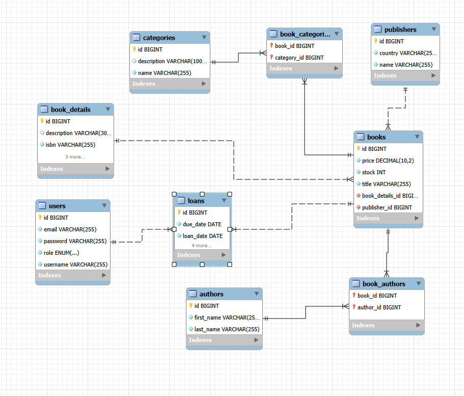

# LibraryManagement

LibraryManagement este o aplicație web dezvoltată cu Spring Boot pentru gestionarea activității unei biblioteci.

Aplicația oferă funcționalități pentru gestionarea cărților, autorilor, categoriilor, editurilor, utilizatorilor și împrumuturilor. Aceasta include un model de date relațional, operații CRUD complete, validare, paginare și sortare, jurnalizare, testare automată și autentificare și autorizare bazate pe roluri folosind Spring Security.

Proiectul a fost dezvoltat în cadrul cursului Advanced Web-Based Development.

---

## Cuprins

- [Descrierea proiectului](#project-description)
- [Funcționalități principale](#main-features)
- [Tehnologii](#technologies)
- [Arhitectură](#architecture)
- [Model de date](#data-model)
- [Relațiile dintre entități](#entity-relationships)
- [Diagrama ER](#er-diagram)
- [Logica de business](#business-logic)
- [Operații CRUD](#crud-operations)
- [Validare și gestionarea erorilor](#validation-and-error-handling)
- [Paginare și sortare](#pagination-and-sorting)
- [Securitate](#security)
- [Jurnalizare](#logging)
- [Configurare pentru medii multiple](#multi-environment-configuration)
- [Testare](#testing)
- [Documentație API](#api-documentation)
- [Instrucțiuni de configurare](#setup-instructions)
- [Rularea aplicației](#running-the-application)
- [Rularea testelor](#running-tests)
- [Deploy](#deployment)
- [Flux de lucru Git](#git-workflow)
- [Structura proiectului](#project-structure)
- [Contribuțiile echipei](#team-contributions)

---

## Descrierea proiectului

LibraryManagement este conceput pentru a simplifica administrarea unei biblioteci.

Sistemul gestionează:

- cărțile și informațiile detaliate despre acestea;
- autorii;
- categoriile;
- editurile;
- utilizatorii aplicației;
- împrumuturile și returnările de cărți.

Aplicația oferă două roluri de autorizare:

- `USER` - poate naviga prin bibliotecă și își poate gestiona operațiile de împrumut permise;
- `ADMIN` - are acces la operațiile administrative și la gestionarea resurselor.


---

## Funcționalități principale

Aplicația include:

- gestionarea a 7 entități interconectate;
- funcționalitate CRUD completă;
- persistență cu Spring Data JPA;
- bază de date MySQL pentru dezvoltare;
- bază de date H2 in-memory pentru testare;
- validare pe server cu Bean Validation;
- validare HTML pe client;
- pagini de eroare personalizate;
- paginare și sortare;
- autentificare cu Spring Security;
- autentificare bazată pe JDBC;
- autorizare bazată pe roluri;
- codificarea parolelor cu BCrypt;
- funcționalitate Remember Me;
- protecție CSRF;
- pagină de autentificare personalizată;
- înregistrarea utilizatorilor;
- funcționalitate de deconectare;
- jurnalizare cu SLF4J și Logback;
- log separat pentru erori;
- teste unitare cu JUnit 5 și Mockito;
- teste de integrare;
- acoperirea codului cu JaCoCo;
- interfață web Thymeleaf.

---

## Tehnologii

### Backend

- Java 17
- Spring Boot 3.5.0
- Spring Web
- Spring Data JPA
- Spring Security
- Bean Validare
- Lombok

### Frontend

- Thymeleaf
- Thymeleaf Extras Spring Security
- HTML5
- CSS3

### Database

- MySQL - development database
- H2 - test database

### Testare

- JUnit 5
- Mockito
- Spring Boot Test
- MockMvc
- Spring Security Test
- JaCoCo

### Build and Version Control

- Maven
- Maven Wrapper
- Git
- GitHub

---

## Arhitectură

Aplicația urmează o arhitectură pe layere:

```text
┌─────────────────────────────┐
│        Presentation         │
│                             │
│ Thymeleaf / Web Controllers │
│       REST Controllers      │
└──────────────┬──────────────┘
               │
               ▼
┌─────────────────────────────┐
│        Service Layer        │
│                             │
│ Business Logic / Validation │
└──────────────┬──────────────┘
               │
               ▼
┌─────────────────────────────┐
│      Repository Layer       │
│                             │
│       Spring Data JPA       │
└──────────────┬──────────────┘
               │
               ▼
┌─────────────────────────────┐
│          Database           │
│                             │
│       MySQL / H2            │
└─────────────────────────────┘
```

### Controller

Aplicația conține două tipuri de controllere:

- controllere REST sub `/api/**`;
- controllere web MVC utilizate de interfața Thymeleaf.

Controllerele primesc cereri HTTP și deleagă operațiile de business către service.

### Service

Service-ul conține logica de business a aplicației.

Responsabilitățile includ:

- crearea și modificarea resurselor;
- validarea duplicatelor;
- gestionarea relațiilor;
- împrumutarea cărților;
- returnarea cărților;
- gestionarea stocului;
- restricții la ștergere;
- codificarea parolelor.

### Repository

Repository-urile folosesc Spring Data JPA și oferă operații de persistență pentru toate entitățile.

Fiecare entitate principală are un repository corespunzător.

### Entity

Entitățile JPA definesc modelul de date relațional și relațiile dintre resursele aplicației.

---

## Model de date

Aplicația conține 7 entități principale:

| Entitate | Descriere |
|---|---|
| `Book` | Reprezintă o carte disponibilă în bibliotecă |
| `BookDetails` | Conține informații suplimentare despre o carte |
| `Author` | Reprezintă autorul unei cărți |
| `Category` | Reprezintă o categorie de cărți |
| `Publisher` | Reprezintă o editură |
| `User` | Reprezintă un utilizator al aplicației |
| `Loan` | Reprezintă un împrumut de carte |

Sunt utilizate enum-uri suplimentare pentru starea aplicației și autorizare:

### Role

```text
USER
ADMIN
```

### LoanStatus

```text
ACTIVE
RETURNED
OVERDUE
```

---

## Relațiile dintre entități

Modelul de date conține toate tipurile de relații.

### One-to-One

`Book` ↔ `BookDetails`

O carte are asociată o singură entitate `BookDetails`, care conține informații precum:

- ISBN;
- numărul de pagini;
- limba;
- anul publicării;
- descrierea.

```text
Book 1 ───────── 1 BookDetails
```

### One-to-Many / Many-to-One

#### Publisher - Book

O editură poate publica mai multe cărți, în timp ce fiecare carte aparține unei singure edituri.

```text
Publisher 1 ───────── N Book
```

#### User - Loan

Un utilizator poate avea mai multe împrumuturi, în timp ce fiecare împrumut aparține unui singur utilizator.

```text
User 1 ───────── N Loan
```

#### Book - Loan

O carte poate apărea în mai multe înregistrări de împrumut de-a lungul timpului, în timp ce fiecare împrumut face referire la o singură carte.

```text
Book 1 ───────── N Loan
```

### Many-to-Many

#### Book - Author

O carte poate avea mai mulți autori, iar un autor poate scrie mai multe cărți.

```text
Book N ───────── M Author
```

#### Book - Category

O carte poate aparține mai multor categorii, iar o categorie poate conține mai multe cărți.

```text
Book N ───────── M Category
```

Relațiile Many-to-Many sunt reprezentate în baza de date relațională folosind tabele de legătură.

---

## Diagrama ER

Următoarea diagramă Entity Relationship reprezintă structura bazei de date și relațiile dintre entitățile aplicației.



Diagrama este generată din schema bazei de date MySQL și documentează relațiile dintre entitățile utilizate de aplicație.

---

## Logica de business

Logica de business este implementată în service.

### Împrumutarea unei cărți

Atunci când o carte este împrumutată:

1. utilizatorul este verificat;
2. cartea este verificată;
3. aplicația verifică dacă respectiva carte este disponibilă;
4. stocul este redus cu o unitate;
5. este creat un nou împrumut;
6. statusul împrumutului este setat la `ACTIVE`;
7. data împrumutului este setată la data curentă;
8. data scadentă este calculată la 14 zile după data împrumutului.

### Returnarea unei cărți

Atunci când o carte este returnată:

1. împrumutul este preluat;
2. aplicația verifică dacă acesta nu a fost deja returnat;
3. data returnării este salvată;
4. statusul împrumutului devine `RETURNED`;
5. stocul cărții este mărit cu o unitate.

### Restricții la ștergere

Resursele la care fac referire date istorice sau relaționale importante nu pot fi șterse dacă acest lucru ar crea o stare inconsistentă.

De exemplu, utilizatorii cu istoric de împrumuturi nu pot fi șterși.

### Prevenirea duplicatelor

Service-ul previne valorile duplicate pentru câmpurile care trebuie să fie unice, inclusiv date precum:

- username;
- email;
- ISBN;
- alte atribute unice ale resurselor.

Erorile de business sunt reprezentate folosind excepții personalizate.

---

## Operații CRUD

Operațiile CRUD sunt implementate pentru entitățile aplicației.

| Entitate | Creare | Citire | Actualizare | Ștergere |
|---|:---:|:---:|:---:|:---:|
| Book | ✓ | ✓ | ✓ | ✓ |
| BookDetails | ✓ | ✓ | ✓ | ✓ |
| Author | ✓ | ✓ | ✓ | ✓ |
| Category | ✓ | ✓ | ✓ | ✓ |
| Publisher | ✓ | ✓ | ✓ | ✓ |
| User | ✓ | ✓ | ✓ | ✓ |
| Loan | ✓ | ✓ | ✓ | ✓ |

Persistența este implementată folosind repository-uri Spring Data JPA.

Sservice-ul se află între controllere și repository-uri pentru a asigura că regulile de business nu sunt implementate direct în controllere.

---

## Validare și gestionarea erorilor

### Validare pe server

Bean Validation este utilizat pentru validarea datelor primite.

Exemplele includ:

```java
@NotNull
@NotBlank
@Min
@Valid
```

Validarea este efectuată înainte ca datele să fie procesate de service.

### Validare pe client

Formularele HTML folosesc atribute de validare ale browserului, precum:

```html
required
type="email"
type="number"
```

Acest lucru oferă feedback imediat înainte ca o cerere să fie trimisă.

### Erori ușor de înțeles pentru utilizator

Erorile de validare sunt afișate direct în formularele Thymeleaf.

Aplicația gestionează și excepții de business precum:

- resursă negăsită;
- resurse duplicate;
- operații invalide.

### Pagini de eroare personalizate

Sunt oferite pagini personalizate pentru erori HTTP, inclusiv:

```text
404 - Resource not found
403 - Access denied
500 - Internal server error
```

Este utilizată și o pagină dedicată erorilor de business, pentru prezentarea într-un mod ușor de înțeles a erorilor apărute în operațiile de business.

---

## Paginare și sortare

Paginarea și sortarea sunt implementate folosind Spring Data `Pageable`.

Paginarea este disponibilă pentru cel puțin trei entități:

- Cărți;
- Autori;
- Utilizatori.

### Sortarea cărților

Cărțile pot fi sortate după:

- titlu;
- preț.

### Sortarea autorilor

Autorii pot fi sortați după:

- prenume;
- nume;
- ID.

### Sortarea utilizatorilor

Utilizatorii pot fi sortați după:

- username;
- email;
- ID.

Interfața cu utilizatorul oferă:

- navigare între pagini;
- direcția de sortare;
- dimensiune configurabilă a paginii.

Dimensiunile de pagină acceptate includ:

```text
5
10
20
```

---

## Securitate

Securitatea este implementată folosind Spring Security.

### Autentificare

Aplicația folosește autentificare bazată pe JDBC.

Datele de autentificare sunt preluate din tabelul `users`.

Aplicația încarcă:

- username;
- parola codificată;
- statusul contului;
- rolul utilizatorului.

### Roluri

Sunt disponibile două roluri:

```text
ROLE_USER
ROLE_ADMIN
```

### Permisiuni USER

Un utilizator obișnuit poate accesa funcționalitățile destinate utilizării normale a bibliotecii, inclusiv:

- navigarea prin resursele bibliotecii;
- vizualizarea cărților;
- vizualizarea autorilor;
- vizualizarea categoriilor;
- vizualizarea editurilor;
- accesarea funcționalităților de împrumut permise;
- returnarea propriilor împrumuturi.

Un utilizator obișnuit nu poate accesa operațiile administrative.

### Permisiuni ADMIN

Un administrator poate accesa funcționalități de administrare precum:

- crearea resurselor;
- editarea resurselor;
- ștergerea resurselor acolo unde este permis;
- gestionarea utilizatorilor;
- vizualizarea informațiilor administrative;
- gestionarea înregistrărilor de împrumut.

Regulile de autorizare sunt aplicate pe server folosind Spring Security.

Interfața ascunde, de asemenea, acțiunile administrative pentru utilizatorii care nu au rolul necesar.

### Securitatea parolelor

Parolele nu sunt niciodată stocate în text simplu.

Aplicația folosește:

```text
BCryptPasswordEncoder
```

Parolele sunt codificate înainte de a fi stocate în baza de date.

Administrarea utilizatorilor nu expune și nu modifică parolele existente ale acestora.

### Înregistrare

Aplicația oferă o pagină publică de înregistrare.

Conturilor noi create prin înregistrare li se atribuie întotdeauna:

```text
ROLE_USER
```

Rolul este impus pe server, împiedicând un utilizator să se înregistreze singur ca administrator.

### Autentificare personalizată

O pagină Thymeleaf personalizată de autentificare este disponibilă la:

```text
/login
```

### Deconectare

Utilizatorii autentificați se pot deconecta în siguranță folosind funcționalitatea de logout a aplicației.

### Remember Me

Aplicația acceptă funcționalitatea Remember Me din Spring Security.

Utilizatorii pot alege să rămână autentificați între sesiunile browserului.

### Protecție CSRF

Protecția CSRF este activată.

Cererile care modifică starea folosesc protecția CSRF din Spring Security, inclusiv formularele Thymeleaf.

Protecția CSRF nu a fost dezactivată la nivel global.

---

## Jurnalizare

Aplicația folosește:

- SLF4J;
- Logback.

Jurnalizarea este configurată folosind:

```text
src/main/resources/logback-spring.xml
```

Aplicația folosește mai multe niveluri de log:

```text
DEBUG
INFO
ERROR
```

Exemple de operații jurnalizate includ:

- crearea resurselor;
- actualizarea resurselor;
- ștergerea resurselor;
- operații de business;
- erori neașteptate ale aplicației.

### Fișiere de log

Logurile generale ale aplicației sunt scrise în:

```text
logs/library.log
```

Erorile sunt scrise separat în:

```text
logs/error.log
```

Fișierele de log sunt excluse din version control.

---

## Configurare pentru medii multiple

Aplicația folosește Spring Profiles pentru a separa mediile de dezvoltare și testare.

### Profil de dezvoltare

Profil:

```text
dev
```

Fișier de configurare:

```text
src/main/resources/application-dev.yml
```

Bază de date:

```text
MySQL
```

Exemplu de URL pentru baza de date:

```text
jdbc:mysql://localhost:3306/library_management
```

Profilul de dezvoltare folosește variabile de mediu pentru configurații sensibile, precum credențialele bazei de date și ale administratorului.

### Profil de test

Profil:

```text
test
```

Fișier de configurare:

```text
src/test/resources/application-test.yml
```

Bază de date:

```text
H2 in-memory
```

Baza de date de test este recreată pentru testarea automată și este independentă de baza de date MySQL de dezvoltare.

### Configurație de bază

Profilul activ de dezvoltare este configurat prin configurația de bază a aplicației.

Separarea dintre MySQL și H2 asigură că testele automate nu modifică datele de dezvoltare.

---

## Testare

Proiectul conține atât teste unitare, cât și teste de integrare.

### Teste unitare

Testele unitare pentru stratul service sunt implementate folosind:

- JUnit 5;
- Mockito.

Repository-urile și dependențele sunt simulate pentru a izola logica de business din service.

Suita de teste acoperă scenarii precum:

- crearea cu succes a resurselor;
- resurse duplicate;
- căutarea resurselor;
- actualizarea resurselor;
- restricții la ștergere;
- împrumutarea cărților;
- returnarea cărților;
- actualizarea stocului;
- codificarea parolelor;
- actualizarea utilizatorilor fără modificarea parolei.

### Teste de integrare

Proiectul conține cel puțin trei scenarii de integrare end-to-end.

Exemplele includ:

#### Author CRUD

Testează fluxul HTTP complet pentru gestionarea autorilor.

#### Borrow Book

Testează faptul că împrumutarea unei cărți:

- creează un împrumut activ;
- reduce stocul cărții.

#### Return Book

Testează faptul că returnarea unei cărți:

- schimbă statusul împrumutului în `RETURNED`;
- mărește stocul cărții.

### Baza de date pentru teste

Testele de integrare folosesc profilul Spring `test` și o bază de date H2 in-memory.

Acest lucru menține testele automate izolate de datele MySQL de dezvoltare.

### Acoperirea codului

JaCoCo este utilizat pentru analiza acoperirii codului.

Stratul service are o acoperire peste pragul necesar de **70%**.

La momentul dezvoltării proiectului, acoperirea instrucțiunilor din stratul service a ajuns la aproximativ **99%**, iar acoperirea ramurilor la aproximativ **78%**.

### Rularea testelor

```bash
./mvnw clean test
```

În Windows PowerShell:

```powershell
.\mvnw.cmd clean test
```

### Raport de acoperire

Pentru a genera raportul JaCoCo:

```bash
./mvnw clean test jacoco:report
```

În Windows:

```powershell
.\mvnw.cmd clean test jacoco:report
```

Raportul generat poate fi găsit la:

```text
target/site/jacoco/index.html
```

---

## Documentație API

Aplicația expune endpoint-uri REST sub prefixul `/api`.

Regulile de autentificare și autorizare se aplică și endpoint-urilor REST protejate.

### Cărți

| Metodă | Endpoint | Descriere |
|---|---|---|
| GET | `/api/books` | Get all books |
| GET | `/api/books/{id}` | Get a book by ID |
| POST | `/api/books` | Create a book |
| PUT | `/api/books/{id}` | Update a book |
| DELETE | `/api/books/{id}` | Delete a book |

### Autori

| Metodă | Endpoint | Descriere |
|---|---|---|
| GET | `/api/authors` | Get all authors |
| GET | `/api/authors/{id}` | Get an author by ID |
| POST | `/api/authors` | Create an author |
| PUT | `/api/authors/{id}` | Update an author |
| DELETE | `/api/authors/{id}` | Delete an author |

### Categorii

| Metodă | Endpoint | Descriere |
|---|---|---|
| GET | `/api/categories` | Get all categories |
| GET | `/api/categories/{id}` | Get a category by ID |
| POST | `/api/categories` | Create a category |
| PUT | `/api/categories/{id}` | Update a category |
| DELETE | `/api/categories/{id}` | Delete a category |

### Edituri

| Metodă | Endpoint | Descriere |
|---|---|---|
| GET | `/api/publishers` | Get all publishers |
| GET | `/api/publishers/{id}` | Get a publisher by ID |
| POST | `/api/publishers` | Create a publisher |
| PUT | `/api/publishers/{id}` | Update a publisher |
| DELETE | `/api/publishers/{id}` | Delete a publisher |

### Detalii carte

| Metodă | Endpoint | Descriere |
|---|---|---|
| GET | `/api/book-details` | Get all book details |
| GET | `/api/book-details/{id}` | Get book details by ID |
| POST | `/api/book-details` | Create book details |
| PUT | `/api/book-details/{id}` | Update book details |
| DELETE | `/api/book-details/{id}` | Delete book details |

### Utilizatori

| Metodă | Endpoint | Descriere |
|---|---|---|
| GET | `/api/users` | Get all users |
| GET | `/api/users/{id}` | Get user by ID |
| PUT | `/api/users/{id}` | Update administrative user information |
| DELETE | `/api/users/{id}` | Delete a user when allowed |

Parolele utilizatorilor nu sunt modificate prin operația de actualizare administrativă.

Utilizatorii obișnuiți noi sunt creați prin funcționalitatea de înregistrare.

### Împrumuturi

API-ul pentru împrumuturi oferă operații pentru gestionarea ciclului de viață al unui împrumut, inclusiv:

- crearea unui împrumut;
- preluarea împrumuturilor;
- actualizarea informațiilor permise despre împrumut;
- returnarea unei cărți;
- ștergerea înregistrărilor de împrumut eligibile.

Operațiile de împrumut conțin logică de business suplimentară pentru disponibilitatea cărților, stoc și statusul împrumuturilor.

---

## Rute web

Interfața Thymeleaf oferă pagini pentru principalele resurse ale aplicației.

```text
/                   Home
/login              Login
/register           User registration
/books              Books
/authors            Authors
/categories         Categories
/publishers         Publishers
/book-details       Book details
/users              User administration
/loans              Loans
```

Accesul la aceste rute depinde de rolul utilizatorului autentificat.

---

## Instrucțiuni de configurare

### Cerințe preliminare

Instalează următoarele programe:

- JDK 17 sau o versiune mai nouă;
- MySQL Server;
- Git.

Maven nu trebuie instalat separat, deoarece proiectul conține Maven Wrapper.

### 1. Clone the Repository

```bash
git clone <YOUR_REPOSITORY_URL>
```

Navighează în directorul proiectului:

```bash
cd AWBD_2026_LibraryManagement
```

### 2. Create the MySQL Database

Deschide MySQL și execută:

```sql
CREATE DATABASE library_management;
```

### 3. Configure Environment Variables

Aplicația folosește variabile de mediu pentru configurațiile sensibile din mediul de dezvoltare.

Variabilele necesare includ parola bazei de date și parola administratorului inițial.

Exemplu:

```text
DB_PASSWORD=your_mysql_password
ADMIN_PASSWORD=your_admin_password
```

Nu adăuga parole reale în commit-urile Git.

Dacă aplicația este pornită din IntelliJ IDEA, variabilele de mediu pot fi configurate în:

```text
Run
→ Edit Configurations
→ Environment variables
```

### 4. Verify Development Configuration

Configurația de dezvoltare este stocată în:

```text
src/main/resources/application-dev.yml
```

Aplicația se conectează la:

```text
jdbc:mysql://localhost:3306/library_management
```

folosind credențialele MySQL configurate.

### 5. Initial Administrator

În timpul dezvoltării, un administrator inițial poate fi creat folosind variabila de mediu `ADMIN_PASSWORD` configurată, atunci când nu există deja un cont de administrator.

Parola administratorului este codificată cu BCrypt înainte de a fi salvată.

Nicio parolă de administrator în text simplu nu trebuie stocată în codul sursă.

---

## Rularea aplicației

### Linux / macOS

```bash
./mvnw spring-boot:run
```

### Windows PowerShell

```powershell
.\mvnw.cmd spring-boot:run
```

Alternativ, rulează:

```text
LibraryManagementApplication
```

direct din IntelliJ IDEA.

Aplicația va fi disponibilă la:

```text
http://localhost:8080
```

Utilizatorii neautentificați sunt redirecționați către pagina de autentificare personalizată.

---

## Rularea testelor

Rulează suita completă de teste automate cu:

### Linux / macOS

```bash
./mvnw clean test
```

### Windows

```powershell
.\mvnw.cmd clean test
```

Suita de teste folosește baza de date H2 de test în locul bazei de date MySQL de dezvoltare.


## Deploy

Versiunea de producție a aplicației este deployată și accesibilă la:

**URL aplicație:** `https://awbd2026librarymanagement-production.up.railway.app/`

Mediul de deploy trebuie să furnizeze variabilele de mediu necesare, în loc să stocheze credențialele direct în repository.

Exemplu de variabile de mediu pentru producție:

```text
DB_PASSWORD=...
ADMIN_PASSWORD=...
```

Pot fi configurate variabile suplimentare pentru conexiunea la baza de date, în funcție de providerul de deploy ales.

### Platforma de deploy

```text
<ADD_PLATFORM_HERE>
```

Exemple:

- Railway;
- Render;
- AWS;
- Azure;
- GCP.

### Securitatea deploy-ului

Informațiile sensibile precum:

- parolele bazelor de date;
- parolele administratorilor;
- credențialele de deploy;

nu trebuie incluse în commit-uri Git.

Acestea sunt furnizate prin variabile de mediu configurate pe platforma de deploy.

---

## Flux de lucru Git

Proiectul folosește Git pentru version control.

Repository-ul este disponibil la:

```text
https://github.com/NicoletaCaramaliu/AWBD_2026_LibraryManagement
```

Dezvoltarea a fost realizată incremental, folosind branch-uri dedicate pentru funcționalitățile principale.

Exemplele includ:

```text
main
dev
feature/data-model
feature/crud
feature/testing
feature/frontend
feature/logging
feature/pagination-sorting
feature/security
```

Branch-urile de feature sunt îmbinate după ce funcționalitatea lor a fost implementată și testată.


Exemplu de flux de lucru:

```bash
git checkout dev
git checkout -b feature/example

git add .
git commit -m "Implement example feature"

git checkout dev
git merge feature/example
```

Versiunea stabilă a proiectului este menținută pe branch-ul `main`.

---

## Structura proiectului

Mai jos este prezentată o structură simplificată a proiectului:

```text
LibraryManagement
│
├── src
│   ├── main
│   │   ├── java
│   │   │   └── org.example.librarymanagement
│   │   │       ├── config
│   │   │       ├── controller
│   │   │       ├── entity
│   │   │       ├── exception
│   │   │       ├── repository
│   │   │       ├── service
│   │   │       └── web
│   │   │
│   │   └── resources
│   │       ├── static
│   │       │   └── css
│   │       │       └── style.css
│   │       │
│   │       ├── templates
│   │       │   ├── authors
│   │       │   ├── book-details
│   │       │   ├── books
│   │       │   ├── categories
│   │       │   ├── error
│   │       │   ├── fragments
│   │       │   ├── loans
│   │       │   ├── publishers
│   │       │   ├── users
│   │       │   ├── home.html
│   │       │   ├── login.html
│   │       │   └── register.html
│   │       │
│   │       ├── application.yml
│   │       ├── application-dev.yml
│   │       └── logback-spring.xml
│   │
│   └── test
│       ├── java
│       │   └── org.example.librarymanagement
│       │       ├── integration
│       │       └── service
│       │
│       └── resources
│           └── application-test.yml
│
├── docs
│   ├── erd.png
│   └── screenshots
│
├── pom.xml
├── README.md
├── mvnw
├── mvnw.cmd
└── .gitignore
```

---

## Acoperirea cerințelor

Următorul tabel rezumă modul în care proiectul îndeplinește principalele cerințe de evaluare.

| Cerință | Implementare |
|---|---|
| Model de date | 7 entități JPA interconectate |
| One-to-One | Book - BookDetails |
| One-to-Many / Many-to-One | Publisher - Book, User - Loan, Book - Loan |
| Many-to-Many | Book - Author, Book - Category |
| ER Diagram | Documentată în README |
| CRUD | Implementat pentru toate entitățile principale |
| Pattern Repository | Spring Data JPA |
| Service Layer | Logica de business separată de controllere |
| Gestionarea excepțiilor | Excepții personalizate și pagini de eroare |
| Bază de date de dezvoltare | MySQL |
| Bază de date de test | H2 |
| Spring Profiles | dev and test |
| Testare unitară | JUnit 5 + Mockito |
| Testare de integrare | Cel puțin 3 scenarii end-to-end |
| Acoperirea stratului service | Peste pragul necesar de 70% |
| Frontend | Thymeleaf |
| Validare | Bean Validare + validare HTML |
| Pagini de eroare | Pagini personalizate 403, 404 și 500 |
| Logging | SLF4J + Logback |
| Log de erori | `error.log` separat |
| Paginare | Cărți, Autori și Utilizatori |
| Sortare | Mai multe criterii pentru fiecare entitate paginată |
| Authentication | Autentificare JDBC |
| Roles | USER and ADMIN |
| Autorizare | Protecția endpoint-urilor bazată pe roluri |
| Autentificare | Pagină de autentificare personalizată |
| Deconectare | Implementat |
| Codificarea parolelor | BCrypt |
| Remember Me | Implementat |
| CSRF | Activată |
| Version Control | Git cu commit-uri incrementale și branch-uri de feature |
| Deployment | URL-ul public documentat după deploy |

---

## Note de securitate

Sunt utilizate următoarele practici de securitate:

- parolele sunt codificate cu BCrypt;
- parolele în text simplu nu sunt persistate;
- autorizarea este impusă pe server;
- elementele administrative ale interfeței sunt ascunse pentru utilizatorii obișnuiți;
- înregistrarea publică creează întotdeauna un `USER`;
- utilizatorii nu își pot atribui rolul `ADMIN` în timpul înregistrării;
- editarea administrativă a utilizatorilor nu expune parolele existente;
- protecția CSRF rămâne activată;
- credențialele sunt furnizate prin variabile de mediu;
- fișierele de log sensibile sunt excluse din Git.

---

## Îmbunătățiri viitoare

Posibile îmbunătățiri viitoare includ:

- verificarea adresei de email;
- funcționalitate de resetare a parolei;
- căutare avansată a cărților;
- filtrare după categorie și autor;
- notificări privind data scadentă a împrumuturilor;
- procesarea automată a împrumuturilor restante;
- gestionarea profilului utilizatorului;
- documentație Swagger/OpenAPI;
- containerizare Docker;
- pipeline CI/CD.


